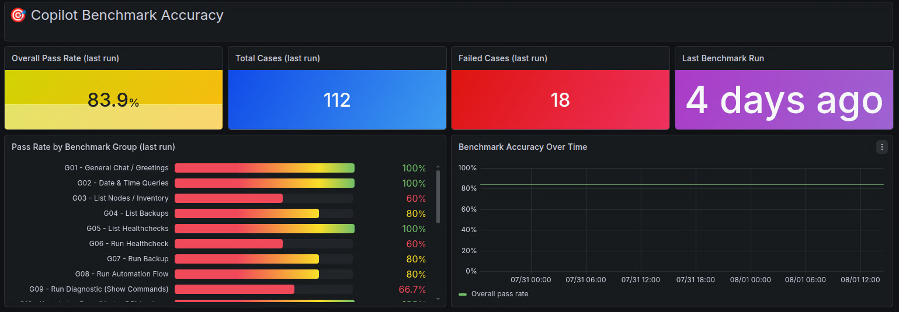
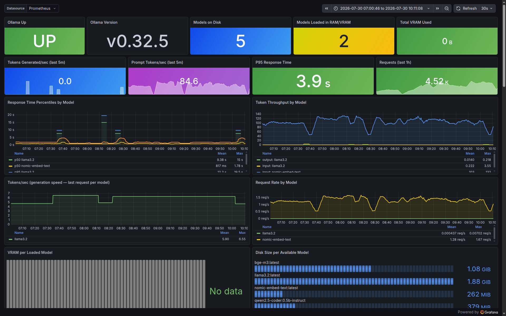
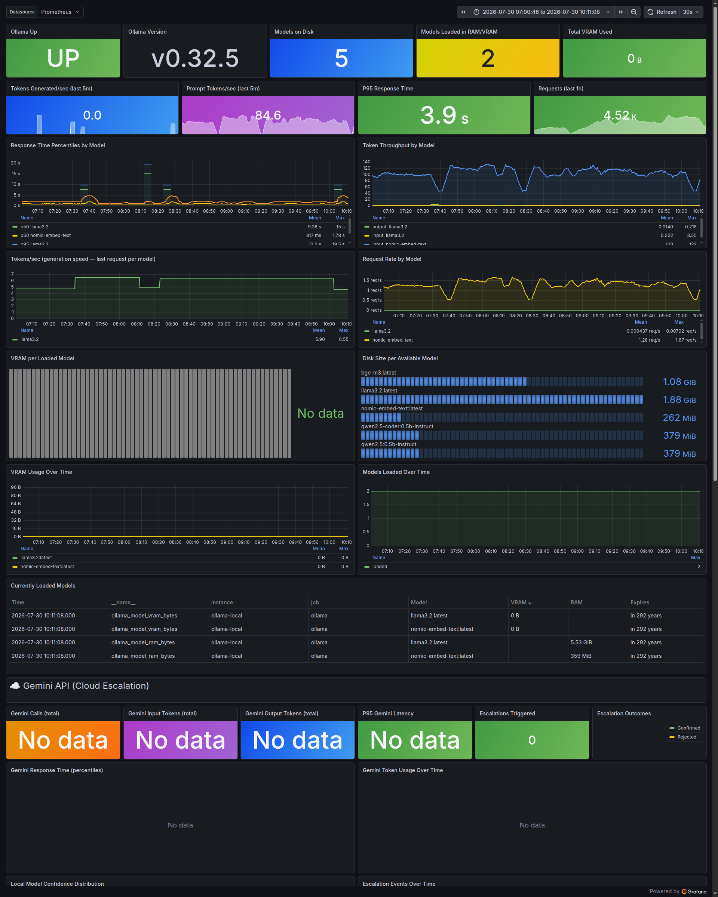
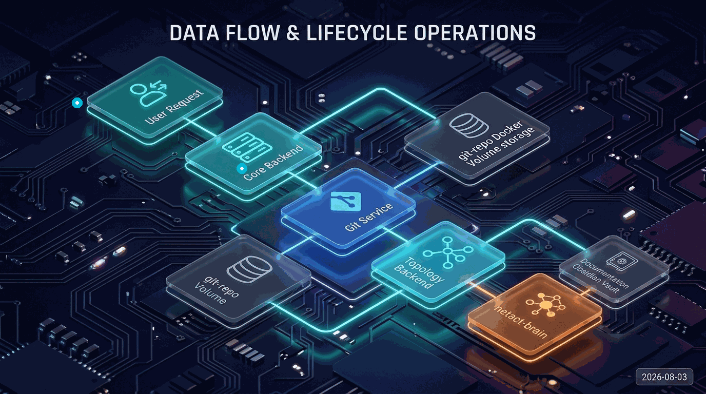
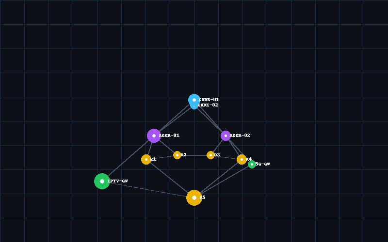

# NETAct: Second-Brain AI, Local ollama&Gemini Escalation  Multi-Vendor Network Configuration Management, Automation & AI Copilot Platform 

NETAct is an ISP network automation (MCP & Ansible), configuration management, topology graphing & analysis, network monitoring, security analysis, and AI copilot platform. It provides seamless configuration backup, automated compliance checks, live topology graphing, and an intelligent chat assistant for multi-vendor environments (Cisco IOS/XR, Huawei, Juniper, Arista, and F5).

### 🚀 Key Focus Areas & Methodologies
`AIOps` • `NetDevOps` • `NetOps` • `DevOps` • `CCIE Level Design` • `HCIE` • `JNCIE` • `Infrastructure as Code (IaC)` • `Model Context Protocol (MCP)` • `LangGraph State Machines` • `Automated Network Configuration & Backup` • `3D Topology Graphing`


---

## Table of Contents

1. [High-Level Architecture](#1-high-level-architecture)
2. [Anatomy of the 5 Stacks](#2-anatomy-of-the-5-stacks)
3. [The AI Copilot System (LangGraph & Qdrant)](#3-the-ai-copilot-system-langgraph--qdrant)
4. [Data Flow & Lifecycle Operations](#4-data-flow--lifecycle-operations)
5. [Anatomy of the User Interface (GUI)](#5-anatomy-of-the-user-interface-gui)
6. [API Catalog (Exhaustive Docker Endpoint Reference)](#6-api-catalog-exhaustive-docker-endpoint-reference)
7. [Setup & Quick Start](#7-setup--quick-start)
8. [Topology Building & Device Collection Mechanics](#8-topology-building--device-collection-mechanics)
9. [`netact` CLI Commands & Console Access](#9-netact-cli-commands--console-access)
10. [Multi-Vendor Feature Support Matrix](#10-multi-vendor-feature-support-matrix)
11. [Troubleshooting & Diagnostics FAQ](#11-troubleshooting--diagnostics-faq)

---

## 1. High-Level Architecture

NETAct is built as a microservices architecture organized into **five independent Docker Compose stacks**. The system communicates via a dedicated Docker network (`netact_config-net`) and shares data across services using a persistent Docker volume (`netact_git-repo`) containing a local Git repository. It integrates `netact-brain` and the Qdrant vector database to analyze network data, dynamically escalating complex queries to Google Gemini based on confidence scoring calculated from local inference and vector searches through a secure Sanitization Gateway.

*   **Vectorized Cache**: All API prompts are processed by the Agent Gateway, and successful responses are vectorized back into Qdrant. This allows future identical or similar queries to be answered instantly from the local database, saving tokens and improving speed, while preserving direct escalation to Gemini via the Sanitization Gateway.
*   **Unified CLI Commands**: Operator commands are unified through a global terminal CLI, giving you direct control over each stack (AI, Brain, Knowledge Base, Topology, Backups) with options to easily write and extend your own subcommands.
*   **Grafana Telemetry**: Model performance and API prompts (both local and public) are monitored in real-time on a custom Grafana dashboard tracking token consumption, model accuracy, execution latency, and data sanitization success.
*   **Documentation Embedding**: The more vendor configuration guides, datasheets, and operation manuals you upload to Qdrant, the higher the accuracy and speed of the local LLM responses.
*   **Benchmarking Suite**: A test-case framework is included to rate and log AI accuracy per device and per topic, which can easily be customized to fit your specific network topology parameters.

#### Platform Benchmarking Results
The more data you upload to the copilot knowledgebase and vectorize for Gemini responses, the higher accuracy and performance rates you achieve.


### Component Relationship Diagram


---

## 2. Anatomy of the 5 Stacks

### 2.1. Core Stack (`docker-compose.core.yml`)
*   **`backend` (:8000)**: A FastAPI service written in Python. It acts as the central coordinator, handles inventory storage, triggers config rollbacks, exports data to Excel, and coordinates backup/healthcheck collections.
*   **`git` (:8002)**: The secure storage gatekeeper. It operates inside the shared `/git/repo` workspace, providing a REST API layer (`git_api:app`) over git operations.
*   **`automation` (:8003)**: A dedicated automation workspace supporting custom playbooks, Ansible execution runs, and a visual node-based workflow designer.
*   **`mcp-server` (:5001)**: Implements the Model Context Protocol (MCP) using Server-Sent Events (SSE). It acts as an execution bridge between the AI Copilot and the real network, exposing read-only diagnostics and configuration tools.
*   **`frontend` (:3000)**: Serves the primary React application. Securely proxied via Nginx with self-signed TLS certificates.

### 2.2. AI Stack (`docker-compose.ai.yml`)
*   **`copilot-backend` (:8010)**: FastAPI application running the LangGraph agent state machine. It manages context retrieval, intent routing, risk assessment, and synthesis.
*   **`ollama` (:11434)**: Serves the local inference models:
    *   `qwen2.5-coder:7b`: Used for prompt parsing, intent classification, and fast diagnostic synthesis.
    *   `nomic-embed-text`: Used to embed documentation and vault notes.
*   **`qdrant` (:6333)**: Vector Database storing embedded representations of Obsidian markdown notes and uploaded network documentation (PDFs, TXT, MD).

### 2.3. Topology Stack (`docker-compose.topology.yml`)
*   **`topology-backend` (:8001)**: Parsers that extract OSPF Link-State Databases (LSDB) and LLDP adjacencies from collected healthcheck command logs. Computes SPF paths (Dijkstra) and renders topology overlays.
*   **`topology-frontend` (:3001)**: High-performance 3D force-directed graph UI built on D3/three.js to visualize physical and logical network links.

### 2.4. Knowledge Stack (`docker-compose.knowledge.yml`)
*   **`netact-brain`**: An event-driven background parser. It compiles live device data, backup states, EOL compliance, and topology links into an organized Markdown structure inside the Obsidian vault.
*   **`obsidian-web` (:8085)**: Runs a VNC-to-web wrapper hosting the official Obsidian application, allowing teams to view and edit notes directly through a browser interface.

### 2.5. Monitoring Stack (`docker-compose.monitoring.yml`)
*   **`prometheus` (:9090)**: Pulls metrics from the Core Backend and the Ollama/Copilot exporters to track execution performance.
*   **`grafana` (:3002)**: Visually graphs platform telemetry, showing device health logs, backup success ratios, and agent synthesis times.

#### AI Models Monitoring Dashboard View


#### AI Models Monitoring Dashboard Full View



---

## 3. The AI Copilot System (LangGraph & Qdrant)

The AI Copilot operates using a hybrid execution flow that bridges local code-generation LLMs with advanced reasoning engines (such as Google Gemini) while enforcing security and auditing controls.

### 3.1. LangGraph State Machine
The chat architecture is built using a LangGraph `StateGraph` configured in [ai/backend/agent.py](file:///d:/NETActgit/ai/backend/agent.py). It guides user inputs through a series of logical validation steps:


#### Node Definitions & Execution Behavior:
*   **`intent_router`**: Classifies queries (e.g., `run_healthcheck`, `show_config`, `compare_configs`, `list_nodes`) and routes them accordingly.
*   **`context_retriever`**: Queries Qdrant to retrieve relevant BGP/OSPF configurations, device telemetry logs, and Obsidian markdown notes.
*   **`tool_planner`**: Inspects MCP tools dynamically to prepare a sequence of execution steps (e.g. executing `show ip interface brief` via pyATS).
*   **`risk_classifier`**: Labels the request tier. If a write action is planned (e.g., config changes), it halts execution and redirects to the approval gate.
*   **`human_approval_gate`**: Uses LangGraph's native checkpointers to interrupt execution, generating an interactive prompt in the UI for administrator approval.
*   **`tool_executor`**: Executes the approved commands against the MCP server.
*   **`local_synthesizer`**: Generates a fast, local response using `qwen2.5-coder:7b`.
*   **`gemini_prompt_preparer`**: Formats and sanitizes a complete prompt for deep reasoning with Google Gemini if local confidence is low.

### 3.2. Qdrant & Vector Syncing (`vector_sync.py`)
Vector syncing is managed by [ai/backend/vector_sync.py](file:///d:/NETActgit/ai/backend/vector_sync.py). Key characteristics include:
*   **GIL-Bypassing Processing**: PDF parsing and text chunking execute inside a separate `ProcessPoolExecutor` to prevent blocking the asyncio event loop.
*   **Volatile Field Hashing**: When computing SHA256 hashes of Markdown notes, the system ignores dynamic timestamps like `last_import:` or `last_healthcheck:`. This ensures that notes are only re-embedded when actual configuration or state changes occur.
*   **Source Categorization**: Documents are segmented inside a single Qdrant collection (`netact_knowledgebase`) using a metadata payload filter (`vault_notes` vs `knowledgebase`).

#### Knowledge Base Ingestion Progress


### 3.3. Sanitization (PII & IP Masking)
Before any data is sent to external LLMs (like Google Gemini), the prompt passes through the `sanitize_prompt()` function to prevent data leaks.
*   **Masking Rules**: Replaces actual values with standardized tokens:
    *   IP Addresses $\rightarrow$ `IP_ADDR_1`, `IP_ADDR_2`
    *   Hostnames $\rightarrow$ `NODE_HOST_1`, `NODE_HOST_2` (detects patterns like `PE-*`, `WAC-*`, `SW-*`)
    *   Email Addresses $\rightarrow$ `EMAIL_ADDR_1`
    *   CLI commands & Custom regex patterns
*   **Bidirectional Translation**: The local backend stores a temporary mapping dictionary. When Gemini returns the response, the tokens are translated back to their original values before being displayed to the user.

---

## 4. Data Flow & Lifecycle Operations



### 4.1. Configuration Backup & Rollback
1.  **Backup Trigger**: A scheduled cron job or a manual POST request triggers a backup.
2.  **Collection**: The backend connects to the device, pulls the running configuration, and passes it to the Git service.
3.  **Git Commit**: The Git service writes the file to `/git/repo/backups/{device_name}/backup_{timestamp}.txt` and commits the changes.
4.  **Rollback**: To restore, the system pulls the target commit from git, generates a diff, translates it into device-specific commands, and pushes them to the device.

### 4.2. Topology Discovery
1.  **Healthcheck Run**: The backend runs standard commands (e.g. `show ip ospf neighbor`, `show lldp neighbors`).
2.  **Log Parsing**: The topology backend reads these logs from `/git/repo/healthchecks/`.
3.  **Adjacency Extraction**: Regular expressions extract routing neighbors and link interfaces to construct a live network graph.

---

## 5. Anatomy of the User Interface (GUI)

The primary interface is built as a single-page React app that integrates device inventory management, interactive topology visualizations, and the AI copilot chat interface.


### 5.1. The Interactive Topology Component
*   **3D Force-Directed Rendering**: Uses ThreeJS/WebGL to draw routers as nodes and physical links as edges.
*   **Map Image Overlay**: Allows administrators to upload floor plans or geographic maps, placing devices at custom coordinates.
*   **Coordinates Sync**: Dragging a node calls `POST /coords` to save the position to the backend, keeping the layout synchronized for all users.

#### 3D Live Topology Motion Visualization:


### 5.2. AI Assistant Panel
*   **Contextual Side Panel**: Stays open during configuration and troubleshooting tasks.
*   **Interactive Gates**: Shows warnings and approval prompts for write actions (e.g., config changes) or cloud transfers.
*   **Diff Previews**: Renders color-coded diff views directly in the chat when comparing configurations.

### 5.3. EOL/EOS & Inventory Panel
*   **Excel Upload**: Supports uploading Excel files for bulk device imports.
*   **Compliance Reports**: Queries the `/eoleos-compliance` endpoint, matching device models against catalog databases to display lifecycle warnings.

---

## 6. API Catalog (Exhaustive Docker Endpoint Reference)

### 6.1. Core Backend (`:8000`)

| Method | Endpoint | Payload / Query Parameters | Description |
|---|---|---|---|
| `GET` | `/health` | None | Returns backend status |
| `GET` | `/devices` | None | Lists all registered devices |
| `POST` | `/devices` | `{"ip": str, "group": str, "hostname": str, ...}` | Registers a new device |
| `POST` | `/devices/reload` | None | Reloads inventory from YAML files on disk |
| `DELETE` | `/devices/{device_id}` | Path parameter: `device_id` | Deletes a device |
| `GET` | `/devices/backups-summary` | None | Gets backup status across devices |
| `GET` | `/devices/healthchecks-summary` | None | Gets healthcheck status across devices |
| `POST` | `/devices/import-excel` | Multipart Form: `file` | Imports devices from Excel |
| `GET` | `/eoleos-compliance` | None | Retrieves EOL/EOS status per device |
| `POST` | `/healthcheck/{device_id}` | Path parameter: `device_id` | Triggers a live healthcheck |
| `POST` | `/healthcheck/group` | `{"group": str, "device_ids": list}` | Runs concurrent group healthchecks |
| `POST` | `/devices/{device_id}/push-config`| Path parameter: `device_id`, Body: `{"config_text": str}` | Pushes configuration changes |
| `POST` | `/backup/{device_id}` | Path parameter: `device_id` | Performs configuration backup |
| `POST` | `/backups/{device_id}/rollback` | Path parameter: `device_id`, Query: `backup_id` | Rolls back device configuration |
| `GET` | `/mcp/servers` | None | Lists Model Context Protocol servers |

### 6.2. Git Service (`:8002`)

| Method | Endpoint | Description |
|---|---|---|
| `GET` | `/repo/status` | Returns the local git workspace status |
| `GET` | `/repo/commits` | Lists commit history |
| `POST` | `/repo/commit` | Commits current changes to the repository |
| `GET` | `/repo/diff/{commit_sha}` | Returns changes made in a specific commit |

### 6.3. Automation Service (`:8003`)

| Method | Endpoint | Payload / Query Parameters | Description |
|---|---|---|---|
| `GET` | `/flows` | None | Lists workflow templates |
| `POST` | `/flows` | `{"name": str, "tasks": list}` | Saves a workflow template |
| `POST` | `/run-flow` | `{"flow_id": int, "extra_vars": dict}` | Executes a workflow |
| `GET` | `/executions/{task_id}` | Path parameter: `task_id` | Returns run status and logs |
| `POST` | `/executions/{task_id}/cancel`| Path parameter: `task_id` | Stops an active execution |

### 6.4. Topology Backend (`:8001`)

| Method | Endpoint | Payload / Query Parameters | Description |
|---|---|---|---|
| `GET` | `/topology` | None | Returns the active topology graph |
| `GET` | `/ospf-topology` | None | Returns the OSPF LSDB routing graph |
| `GET` | `/path` | Query parameters: `src`, `dst` | Computes Dijkstra shortest path |
| `GET` | `/coords` | None | Gets device coordinates |
| `POST` | `/coords/bulk` | Body: `{"coords": [{"device": str, "x": float, "y": float}]}` | Saves coordinates |

### 6.5. AI / Copilot Backend (`:8010`)

| Method | Endpoint | Payload / Query Parameters | Description |
|---|---|---|---|
| `POST` | `/api/copilot/chat` | `{"message": str, "session_id": str}` | Core LangGraph agent chat endpoint |
| `POST` | `/api/copilot/sync` | None | Syncs files and PDFs into Qdrant |
| `POST` | `/api/copilot/sync-vault` | None | Syncs Obsidian vault notes into Qdrant |
| `GET` | `/api/copilot/approvals/pending`| None | Lists pending admin approvals |
| `POST` | `/api/copilot/approvals/action`| `{"action_id": str, "status": "approved"/"rejected"}` | Resolves a pending action |

---

## 7. Setup & Quick Start

### 7.1. Prerequisites
Ensure you have Docker and Docker Compose installed on your host machine.

### 7.2. Environment Configuration
1.  Copy the environment template:
    ```bash
    cp .env.example .env
    ```
2.  Open `.env` and fill in your details:
    *   Configure your jump host details (`JUMP_HOST`, `JUMP_USER`, `JUMP_PASSWORD`).
    *   Set your app security key (`APP_PASSWORD`).
    *   Set your Google Gemini API key (`GEMINI_API_KEY`).

### 7.3. Spin Up Stacks
Run the startup script. This will generate local TLS certificates and start the containers in the correct order:
```bash
# On Linux/macOS:
./start_all.sh

# On Windows (PowerShell/CMD):
.\start_all.bat
```

### 7.4. Clean Deployments (Resetting Volume Data)
To completely delete the configuration backup and healthcheck history:
```bash
# Stop all containers and delete volumes
./delete_all.sh
```
Or run `docker compose down -v` on the core stack:
```bash
docker compose -f docker-compose.core.yml down -v
```

---

## 8. Topology Building & Device Collection Mechanics

The visual topology and diagnostic collection features rely on a tightly integrated sequence of parsing, transport, and routing computations.

### 8.1. Topology Generation Flow (OSPF & LLDP)
The `topology-backend` container parses network discovery outputs stored in `/git/repo/healthchecks/` to build the topology map:
*   **Log Invalidation and Splitting**: The system parses the latest healthcheck outputs for each device, splitting multi-command runs into `{command -> output}` blocks.
*   **LLDP Neighbor Parsing**: Specific regex parsers parse LLDP neighbor command results depending on the vendor:
    *   *Cisco/NX-OS*: Matches Device ID, Local/Remote interface, capabilities, and port ID.
    *   *Huawei*: Matches neighbor brief layout structures.
    *   *Juniper*: Extracts interface and remote host details.
*   **OSPF Peer & Adjacency Parsing**: Parses `show ip ospf neighbor` (or vendor equivalent) to extract neighbor Router IDs, Local interfaces, Neighbor IPs, and adjacency states (e.g., `FULL`, `2WAY`).
*   **OSPF LSDB Link Parsing**: Parses `show ip ospf database router` to construct logical link-state tables containing router-to-router connections, interface links, and metrics.
*   **Graph Synthesis**: Links are compiled in three stages:
    1.  *LLDP Matching*: Pairs adjacent devices by matching complementary Local and Remote interfaces.
    2.  *OSPF Matching*: Merges OSPF adjacency states into the matching LLDP physical links.
    3.  *OSPF-Only Matching*: Pairs remaining unmatched OSPF peers (where LLDP is disabled or not supported) to create logical edges.
*   **Path Calculation (Dijkstra)**: The `/path` endpoint runs Dijkstra's algorithm over the parsed OSPF link metrics to calculate the shortest path between any two router IDs.

### 8.2. Device Collection Mechanics (SSH & Telnet Transport)
The `NETAct_backend` acts as the single execution path for network device interaction, either directly or via a bastion/jump server:
*   **Bastion/Jump Host Redirection (`AsyncJumpTransport`)**:
    *   Uses parameters `JUMP_HOST`, `JUMP_USER`, and `JUMP_PASSWORD` to open a SSH tunnel.
    *   For **SSH** (`connection: ssh`): Opens a secure port-forwarded TCP tunnel through the jump host to the target device's SSH port (typically 22). It then uses `asyncssh` to authenticate and run the commands.
    *   For **Telnet** (`connection: telnet`): Spawns an interactive PTY session on the jump host and runs a local `telnet <device_ip> <port>` client redirecting stdin/stdout.
*   **Telnet Authentication Negotiation**:
    *   Monitors stdout for usernames (matching regex `[Uu]ser(name)?[:\s]|[Ll]ogin[:\s]`) and sends the device username.
    *   Monitors stdout for passwords (matching regex `[Pp]ass(word)?[:\s]`) and sends the device password.
    *   Once the device prompt is detected (matching vendor configuration patterns), it proceeds.
*   **Terminal Paging Handling**:
    *   Before executing any diagnostic or backup commands, the transport automatically disables output paging (e.g., sending `terminal length 0` on Cisco, or `screen-length 0 temporary` on Huawei) to prevent the collection from hanging on `--- More ---` prompts.
*   **Graceful Termination**: Sends exit commands (e.g. `exit` or `quit`) to close sessions cleanly.

### 8.3. NETAct Brain Importer (`importer.py`)
The `netact-brain` service acts as the automated documentation sync that populates the Obsidian vault:
*   **Event-Driven Triggering**: It operates as a daemon (`importer.py --loop`) that runs on startup and wakes up immediately upon receiving a REST trigger on `POST /api/brain/import` (sent by backend whenever config states or health status change).
*   **API Merging**: Connects to the Core Backend (`:8000`), Topology Backend (`:8001`), and Automation Service (`:8003`) to aggregate live parameters.
*   **Vault Generation**: Generates interlinked markdown (`[[wikilinks]]`) across 8 specific directories inside the Obsidian vault (`/app/obsidian_topology/`):
    *   `Devices/`: Contains one file per device detailing live statuses, IP addresses, vendor details, and health scores.
    *   `HealthChecks/`: Holds command output summaries for individual devices.
    *   `Topology/`: Summarizes neighbor linkages and OSPF adjacencies.
    *   `Sites/`: Groups routers and switches by geographical/logical sites.
    *   `Inventory/`: Tracks CMDB device properties.
    *   `EOL/`: Lists EOL/EOS support compliance notes.
    *   `Backups/`: Tracks backup statuses, dates, and gold-standard references.
    *   `Automation/`: Records histories of executed flows and playbooks.

### 8.4. MCP Server Parsing Layer (Genie & TTP)
To provide the AI agent with clean telemetry instead of raw terminal logs, the `mcp-server` (:5001) implements advanced parsing libraries:
*   **Cisco pyATS & Genie**: Cisco IOS and NX-OS outputs are parsed via `genie.libs.parser`. For example, `show ip interface brief` is converted into a structured JSON dict detailing status, protocols, and IP allocations.
*   **Template Text Parser (TTP)**: Huawei and non-Cisco outputs are processed using `ttp` matching templates. The server uses pre-configured templates (e.g., [huawei_templates.py](file:///d:/NETActgit/core/mcp_server/huawei_templates.py)) to parse and structure Huawei CLI strings into clean lists of dictionary objects.
*   **Fallback Handling**: If templates fail to parse, the server falls back to returning raw, cleaned text to prevent data loss.

### 8.5. Automation Execution Layer (Visual & Ansible)
The `Automation` container (:8003) compiles and runs configuration workflows:
*   **Standard Executors**: Performs standard configuration checks, backups, and status inquiries.
*   **Ansible Runner**: Invokes python-based runner pipelines to run YAML Ansible playbooks locally against target groups.
*   **Visual flow execution**: Translates node configurations from the visual designer into a serial workflow task execution tree.
*   **AI-Driven Execution Steps**: Orchestrates execution steps that call Ollama's local LLMs to evaluate configuration baselines or diagnose issues automatically.

---

## 9. `netact` CLI Commands & Console Access

The `netact-cli` package located at [cli/](file:///d:/NETActgit/cli/) exposes a unified command-line interface `netact` allowing operators to control backups, inventory, topology, and the AI copilot directly from a terminal.

### 9.1. Installation on the Host Machine
To run the CLI locally outside Docker, navigate to the project root and install it in editable mode:
```powershell
# Navigate to the project root directory
cd D:\NETActgit

# Install using pip (requires Python >=3.9)
pip install -e cli/
```
This registers the global binary/shortcut `netact` in your environment.

### 9.2. Accessing the Command Shell

#### Host Machine Console (Outside Docker)
Run any subcommand directly from your Windows PowerShell or Command Prompt. The CLI reads the connection settings mapping localhost ports to their corresponding containers:
```powershell
# Verify installation
netact --help

# Start the interactive AI Copilot chat shell
netact ai chat
```

#### Container Console (Inside Docker)
If you need to run troubleshooting scripts or execute commands from within the Docker network namespace:
1.  **Shell into the backend container**:
    ```bash
    docker exec -it NETAct_backend sh
    ```
2.  **Execute scripts or run CLI tasks** inside the container:
    ```bash
    # Check loaded device configurations
    python test_connection.py
    ```

---

### 9.3. Command Reference

#### System & Platform Commands
*   `netact version`: Prints CLI package and platform versions.
*   `netact status`: Queries the health check endpoints of all running stacks.
*   `netact ps`: Lists active `NETAct_*` container IDs and statuses.
*   `netact logs <service> [--tail N] [-f]`: Tails standard logs for a specific service container.
*   `netact doctor`: Validates Qdrant and Ollama connectivity and reports missing assets.
*   `netact upgrade`: Rebuilds and pulls updates for all 5 stacks in sequence.
*   `netact healthcheck <device_id>`: Triggers an immediate diagnostic healthcheck on the target device.

#### Inventory Management (`netact inventory <subcommand>`)
*   `netact inventory list`: Queries `GET /devices` to display all registered nodes.
*   `netact inventory sync`: Triggers `POST /devices/reload` to load inventory updates from disk.
*   `netact inventory import <file.xlsx>`: Bulk-imports device records from an Excel spreadsheet.

#### Backup & Rollback (`netact backup <subcommand>`)
*   `netact backup create [device_id] [--group <name>]`: Backs up running-configs.
*   `netact backup restore <device_id> --backup-id <id>`: Rolls back a device to a specific git commit hash.

#### Topology Graphing (`netact topology <subcommand>` / `netact graph <subcommand>`)
*   `netact topology show`: Outputs the current list of nodes and connection edges.
*   `netact graph rebuild`: Re-triggers graph community clustering and runs Obsidian-to-Qdrant sync.

#### Visual Workflows (`netact workflow <subcommand>`)
*   `netact workflow list`: Lists saved workflow templates.
*   `netact workflow run <flow_id>`: Starts execution of the specified workflow.
*   `netact workflow status <task_id>`: Returns the status and log of an in-flight workflow.
*   `netact workflow stop <task_id>`: Cancels a running workflow execution.

#### AI Copilot Interface (`netact ai <subcommand>`)
*   `netact ai ask "<question>"`: Sends a single question, prints the streamed response, and exits.
*   `netact ai chat`: Starts a stateful, interactive session keeping the same conversation history.
*   `netact ai models`: Lists available Ollama models.

---

## 10. Multi-Vendor Feature Support Matrix

| Vendor OS | Command Transport | Config Backup | Config Rollback | LLDP Parsing | OSPF LSDB Neighbors | pyATS/Genie Parsing |
|---|---|---|---|---|---|---|
| **Cisco IOS/XE** | SSH & Telnet | Verified | Verified | Verified | Verified | Yes |
| **Cisco NX-OS** | SSH | Verified | Verified | Verified | Verified | Yes |
| **Huawei VRP** | SSH & Telnet | Verified | Verified | Verified | Verified | Yes (TTP Template) |
| **Juniper Junos** | SSH | Verified | Verified | Verified | Verified | Yes (TTP Template) |
| **Arista EOS** | SSH | Verified | Verified | Verified | Verified | Yes |
| **F5 BIG-IP** | SSH (TMSH) | Verified | Verified | N/A | N/A | Yes |

---

## 11. Troubleshooting & Diagnostics FAQ

### 11.1. Nginx Fails to Start due to Missing SSL Certificates
*   **Symptom**: `netact-frontend` container boots but exits immediately with SSL path errors.
*   **Resolution**: Run `.\start_all.bat` (or `./start_all.sh`), which executes the certificate generation routine inside `DeepConsol/certs/` automatically using a secure local OpenSSL script.

### 11.2. Local Ollama Service Connection Timeouts
*   **Symptom**: AI Copilot chat returns `503 Service Unavailable` or times out waiting for `qwen2.5-coder`.
*   **Resolution**: Ensure the Ollama container is fully running (`docker compose -f docker-compose.ai.yml ps`). If it is running on a slow CPU host, increase local timeout limits in your `.env` file using the `OLLAMA_TIMEOUT_SECONDS` variable.

### 11.3. Qdrant Vault Sync Fails after Markdown Updates
*   **Symptom**: Reindexing fails or Qdrant returns a collection mismatch error.
*   **Resolution**: Run `netact doctor` to verify database health. If needed, trigger a clean sync using the CLI:
    ```bash
    netact graph rebuild
    ```


